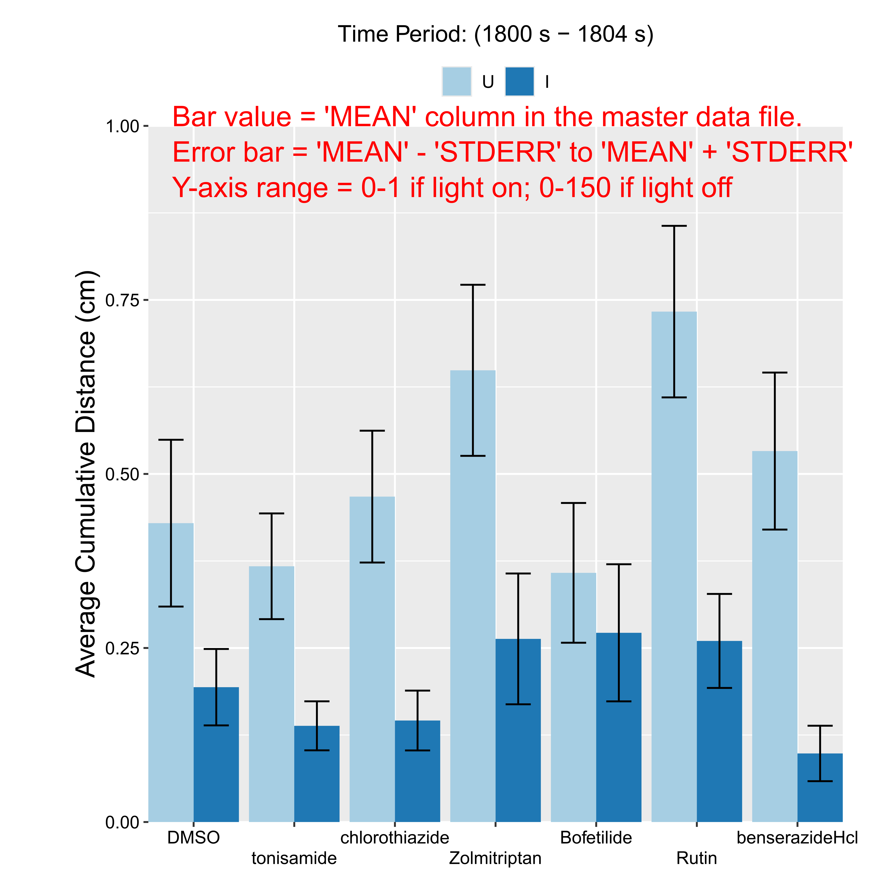
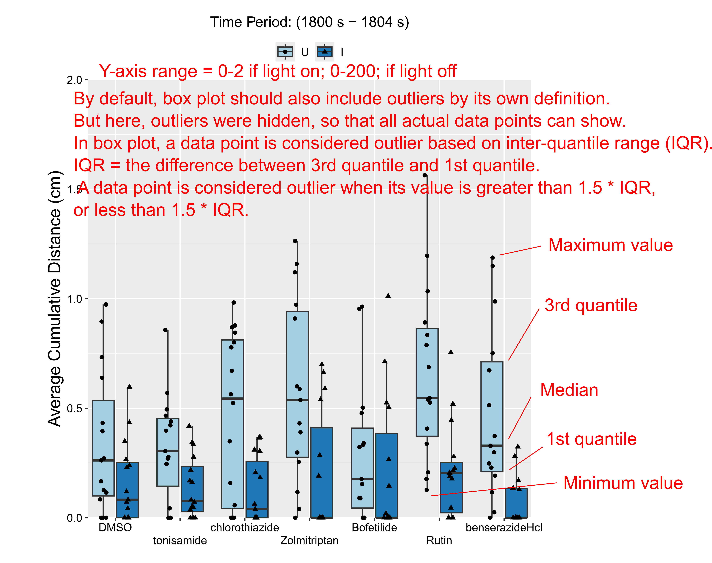

# SCI VMR R

This GitHub page is the backup/public version of the project "SCI VMR R", developed for Suter Lab at Purdue University. The goal is to have a R version of the analysis for the SCI VMR data. To request the sample data or the access to the private version of the code, please contact me. 

## Important Notes

1.  The code is intended for a specific layout for SCI VMR. In this lay out, a treatment group, e.g. 'DMSO_I' takes two columns in the 96-well plates. Hence, at most, there are 3 compounds tested, 6 treatment in total, per plate. If the layout changes, please DO NOT use analysis here.
2.  The code 'pool' all the data files from the input directory, by default.
3.  I do update the content in the Data Repository sometimes to fix issues or update instructions. If you are not sure if you are using the up-to-date code, please check the update log in the repo or contact me.

## Get Started

### Prerequisite

This code is built in R. The latest R and Rstudio are recommended for running the code. If you are pretty familiar with R, skip the next sub points.

#### If you are new to R:

##### Install R

R is a free programming language. You can download the latest R on this website: <https://www.r-project.org/>

After clicking this link, locate the "Download" option on the left and click the "CRAN" link. Choose a host you would like to download from. In most cases, you can simply choose the "0-Cloud" link. But, if you are in part of the world where access internet may be restricted, you can choose a host the closest to your location. Either way, after clicking on a host link, simply choose and download the version for your operating system.

Following the download, go ahead and run the installer.

##### Install Rstudio

The easiest way to write, modify, manage and run R code is to use Rstudio as your coding environment. This Rstudio is an "integrated development environment", or IDE.

To install Rstudio, go to the following website: <https://posit.co/download/rstudio-desktop/>

This website should be able to detect what operating system you are using. Go ahead download the installer and install the Rstudio.

##### Run R code in Rstudio

The preferred way to edit and run R code is to open the ".R" file in Rstudio. After installing Rstudio, you should see that the icons for all your ".R" files are changed to the Rstudio icon. This means you can double-click the ".R" files and the code/script will be opened in the Rstudio.

If this is your first time using the code, make sure you install the packages and make changes following the instructions below.

After making the changes, you can now run the code. Locate the "Run" icon in the upright quadron of the window, where you see the code. On the top right of this quadron, you should see a icon with a tiny green arrow that says "Run." Click on that little triangle drop down and click "Run All." Alternatively, you can select all code (i.e. ctrl+A or command+A) and then hit that little "Run" icon. Then the script will be run.

##### Run R code without Rstudio (Not super recommended, but will work if Rstudio cannot be installed)

Obviously, you can totally run the R code without the Rstudio. To edit the code, open the ".R" file with the default file editing or notepad program on your operating system.

For Windows, it should be "Notepad"; For Mac OS, it should be "TextEdit"; On Linux, it most likely will be "gedit". You can open the ".R" file and edit however you like. For the first time use, make sure you install the required packages following the instructions below.

After editing the R code, you can now run the R code. TO do so, open the R program. On the interface, the deafault window should be a R console where you can type certain commands to interact with the system.

To run the code, simply change your working directory to where you have the "SCI_master_1.R" and "input_output_parameter.R" file. To do so, type the following command in that console with your the directory address:

```{r}

setwd("C:/Purdue_related/research/SCI_R/git-test/")
#change the address in your quotation mark
```

Before running the code, make sure you edit the "input_output_parameters.R" and change the running parameters, where the input and output files are, and other things you would like to modify. If all the changes are made, and the working directory is changed to where the scripts are, you can type in the following command to run the code:

```{r}

source("input_output_parameters.R")
#run the code
```

See the sections below on how to install packages and change the parameters, if this is your first time running the code.

### Installing Required Packages

If this is your first time using the code, please make sure you install the packages required to run the code:

```{r setup, include=FALSE}

#install.packages(c('rstatix', 'plotrix', 'ggplot2'))
```

This line is also the Line 3 in the "input_output_parameters.R". If this is your first time running this this script. Please make sure you remove the leading hash "\#" in the line and run the code. This will ensure that the packages are installed the first time you run. If you have already installed the packages or finish your first run without any issue, please put the lead hash "\#" back to this line, so that you are not installing the packages every time you are running it (installation usually take some time).

You can run this command in the console or include this in the code when you first run.

This is to ensure the `SCI_master_1.R` will run to generate statistical testing and plotting outputs.

### Running Test

To run this test, please download the test data files from the Purdue University Research Repository (PURR):

<https://purr.purdue.edu/projects/suterlabscivmrr/files>

The main code to run is the `input_output_parameters.R`, where several parameters will have to be specified. The other code `SCI_master_1.R` has all the functions to do preprocessing, statistical testing and generate plots.

After installing the required packages, load the `input_output_parameters.R` file. Make sure to change the working directory to where the `SCI_master_1.R` code is stored. By default, it is located in the same directory as the `input_output_parameters.R` file. To specify the working directory, you can change the content in the quotation mark located in the Line 1 of `input_output_parameters.R`:

```{r change wd}

setwd("C:/Purdue_related/research/SCI_R/git-test/")
```

When you type/copy the address, make sure you use forward slash "/" to seperate the different layers of directory. This is the default for Mac OS and Linux, but Windows uses backward slash "\\" by default. If you decide to copy the address from the address bar in the Windows system, make sure you change it. The simplest way to change it will be the "find and replace" function in the "Edit" drop-down menu for either Rstudio or your preferred text editor.

You can then specify the directories for the input data and outputs. By default, the code will load all '.xls' files. Note that, the output files from the Viewpoint ZebraLab is not really Microsoft Excel files. They are actually '.csv' files but manually renamed as '.xls' files. So do not use other functions related to loading Excel files.

```{r input and output}

input_dir <- "C:/Purdue_related/research/SCI_R/git-test/example_data/data_1/"
#specify alternative directory for where the input files are
out_dir <- "C:/Purdue_related/research/SCI_R/git-test/example_output/"
#specify alternative path directory for where the output will be generated 
```

The following lines are specifying the conditions used for statistical testing and plotting.

First, specify the control groups in the input data that will be analyzed. Please follow the same naming convention as in the file names, because the code will read the input file names and name the wells by the names specified in the file names.

```{r control name}

#specify the control groups to help with the order in plotting
neg_ctrl <- c("DMSO_U", "DMSO_I")
```

Second, specify the time periods you would like to analyze for the light-on and -off VMR.

```{r}
light_seg_on <- 1800:(1800+5-1) # time segment for light on
light_seg_off <- 2400:(2400+10*60-1) # time segment for light off
```

Here, the light-on period covers from 'start = 1800' to 'start = 1804', total of 5 sec in the VMR output file. The light-off period covers from 'start = 2400' to 'start = 2999', total of 600 sec (10 min) in the VMR output file. \## R Markdown

Third, specify if the data should be 'cleaned' and 'zero-removed.' 'clean' means that the outliers will be removed in corresponding light period. Here, outliers are defined as samples with distance vale higher than 'mean+2\*std' or lower than 'mean-2\*std'

```{r clean}

on_clean <- TRUE
#TRUE = remove the outliers, in light on data
off_clean <- TRUE
#TRUE = remove the outliers, in light on data
remove_zero_flag <- FALSE
#TRUE = remove the samples have cumulative 0 distance in both light on and off
```

'zero' refers to samples that have 'cumulative distance = 0' in the windows for analysis of both the light-on and -off periods.

After specifying the parameters, the following line will import and run the code from 'SCI_master_1.R' file.

```{r master}

source("SCI_master_1.R")
```

The output files will be saved to a subdirectory of the output directory previously specified. This subdirectory follows a naming convention of 'Output-Year-Month-Day-Hour-Minute-Second-TimeZone'. Every time the 'SCI_master_1.R' is imported and run, a new subdirectory will be created, based on the start time.

### Outputs

There are three major outputs generated in the output directory:

1.  master data
2.  statistical testing results
3.  plots

The directory structure should look like this (see the 'example output' folder for details):

``` bash
./
|___All_Conditions_cumulateive_distance.csv
|___light-off
| |___cumulateive_distance_BarChart_2400_2999_CLEAN.pdf
| |___cumulateive_distance_BoxPlot_2400_2999_CLEAN.pdf
| |___shapiro_wilk_normality_2400_2999_CLEAN.csv
| |___stats_ANOVA_cumulative_distance_2400_2999_CLEAN.txt
| |___stats_tTest_cumulative_distance_2400_2999_CLEAN.csv
| |___stats_TukeyHSD_cumulative_distance2400_2999_CLEAN.csv
|___light-on
| |___cumulateive_distance_BarChart_1800_1804_CLEAN.pdf
| |___cumulateive_distance_BoxPlot_1800_1804_CLEAN.pdf
| |___shapiro_wilk_normality_1800_1804_CLEAN.csv
| |___stats_ANOVA_cumulative_distance_1800_1804_CLEAN.txt
| |___stats_tTest_cumulative_distance_1800_1804_CLEAN.csv
| |___stats_TukeyHSD_cumulative_distance1800_1804_CLEAN.csv
```

#### Master Data

'Master data' refers to the '.csv' file on the top level of the directory. This is the input data used for the downstream statistical analysis and plotting.

Here is a quick look on the top several rows of this 'Master data'

```{r}
head(full_list.df)
```

Each row is the data for a sample, i.e. larva, in the VMR experiment. Columns listed the information about this sample:

'Date' = The date when the VMR experiment was run. The same as in the file name of the input file.

'Location' = The location of the larva in the 96-well plate when the experiment was run. It follows a format of "LocA+number." The numbers follow ascending order across each column in a row. E.g., "LocA13" refers to the B1 well in the 96-well plate.

"aname" = The animal name, created by joining the "treatment" and "injury" column, separated by underscore.

"treatment" = The drug treatment for the larva. This information is the same in the file name of the input file.

"injury" = The injury condition for the larva. This information is based on the location of the larva. In the default 96-well plate layout for SCI VMR, the first two columns per treatment are "uninjured" and the following two columns are "injured."

"distance" = The cumulative distance per larva in the defined "start" and "end" time points.

"start" = The starting time point of analysis. Defined in the `input_output_parameters.R` file.

"end" = The ending time point of analysis. Defined in the `input_output_parameters.R` file.

"zero" = A flag to indicate if the larva meets the criteria of a "zero" larva, defined as having 0 values in the "distance" column during both analysis periods (by default, light-on = 1800-1804, light-off = 2400-2999). If a row meets this criteria, then return 0 in this "zero" column.

"MEAN" = the mean of the "distance" value for all rows (larvae) with the same "aname" value in the analysis period.

"STDEV" = the standard deviation of the "distance" value for all rows (larvae) with the same "aname" value in the analysis period.

"STDERR" = the standard error of the "distance" value for all rows (larvae) with the same "aname" value in the analysis period.

"outlier" = A Boolean column to flag if the larva meets the criteria for an "outlier." An "outlier" is defined as a larvae whose "distance" value is higher than `'MEAN' + 2*'STDEV`, or lower than `'MEAN'-2*'STDV'`. If yes, then 'outlier' column returns `FALSE`. Based on the values for `on_clean` and `off_clean` in `input_output_parameters.R` file, the statistical analysis may include or exclude the 'outliers.'

"remove_zero" = A Boolean column to match the values for `remove_zero_flag` in `input_output_parameters.R` file. If `TRUE`, the 'zero' larvae will be removed in the statistical analysis and plotting.

#### Statistical Testing Results

'Statistical testing results' refers to the '.csv' files in the sub-directories for different purposes of testing. In the output folder for each ligtht condition, there are four files related the the statistical testing output:

"DATE_shapiro_wilk_normality_START_END_OUTLIERREMOVE.csv" = Output for Shapiro-Wilk normality test. When "'p.value' \< 0.05", the 'normality' column returns to `FALSE`, indicating the data for the condition does not follow normal distribution.

"DATE_stats_ANOVA_cumulative_distance_START_END_OUTLIERREMOVE.txt" = Output for the 1-way ANOVA.

"DATE_stats_tTest_cumulative_distance_START_END_OUTLIERREMOVE.csv" = Output for Student's T test. Note, refer to the 'p.adj' column for the p-value after multiple hypothesis adjustment. The adjustment method uses the "FDR" method, or "False Discover Rate" method.

"DATE_stats_TukeyHSD_START_END_OUTLIERREMOVE.csv" = Ouput for Tukey HSD test, the default ad hoc test for ANOVA. Note, refer to the 'p.adj' column for the p-value after multiple hypothesis adjustment. The adjustment method uses the the default Tukey HSD adjustment method.

#### Plots

'Plots' refers to the '.pdf' files in the sub-directories. There are two plot outputs for each period of time, corresponding to the light condition:

"DATE_cumulateive_distance_BarChart_START_END_OUTLIERREMOVE.pdf" = \> See Fig 1.



"DATE_cumulateive_distance_BoxPlot_START_END_OUTLIERREMOVE.pdf" =\> See Fig 2.



## Authors

Beichen "BC" Wang - intital work - wang4537 at purdue.edu

## License

This proejct is licensed under GNU General Public License v3.0. Please see the 'License' file for the details.

## Acknowledgments

All example SCI VMR data were generated by SCI team members from Suter Lab. Thank you very much for your hard work.
